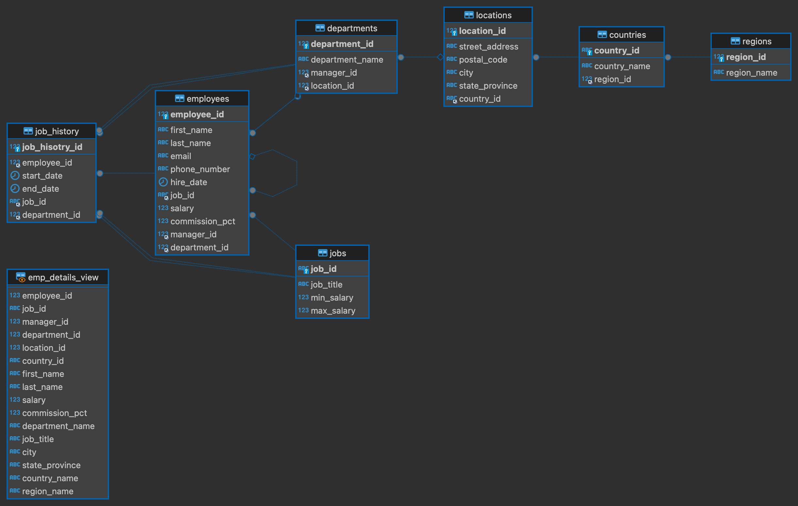

# 에코앤리치\_코딩과제(Back-End)

## 소개

이 프로젝트는 에코앤리치의 코딩과제로, 개발 아이디어 및 지원자의 기술 활용도를 평가하기 위해 구현되었습니다.

Oracle의 HR 스키마의 더미 데이터를 활용하여 구축한 RESTful API로, 사원 정보, 부서 및 위치 정보 조회 등의 기능을 제공합니다.

주요 구현 기능은 다음과 같습니다:

- 특정 사원의 현재 정보 및 이력 정보 조회
- 부서 및 위치 정보 조회
- 특정 부서의 급여 인상 및 사원 정보 업데이트
- 공공 데이터 포털 API를 활용한 커스터마이즈된 API 구현

사용된 기술 스택은 NodeJS(NestJS), MySql(Maria DB), AWS(EC2)입니다.

프로젝트 저장소: [GitHub - 에코앤리치 코딩과제](https://github.com/coolmarvel/echonrich-preview)

## 사용 방법

1. `.env.example` 파일을 `.env`로 복사하고 환경변수를 설정합니다.
2. KOFIC API 키는 [여기](https://www.kobis.or.kr/kobisopenapi/homepg/apiservice/searchServiceInfo.do)에서 발급받을 수 있습니다.
3. [SQL](https://github.com/coolmarvel/echonrich-preview/blob/master/src/common/sql/test.sql) 스크립트를 사용하여 데이터베이스 및 테이블을 생성하고 더미 데이터를 삽입합니다.
   
4. 설정을 완료한 후, `npm run start:dev`나 `npm run start` 명령어로 서버를 실행합니다.

## 배포된 서버

- 서버 URL: [http://54.253.102.91:3000](http://54.253.102.91:3000)
- Swagger API 문서: [http://54.253.102.91:3000/docs](http://54.253.102.91:3000/docs) (username: echonrich, password: echonrich)

## 저자 및 기여자

- 이성현
  - Email: [marvel19971125@gmail.com](mailto:marvel19971125@gmail.com)
  - GitHub: [coolmarvel](https://github.com/coolmarvel)

## 감사의 글

이 프로젝트를 구현할 수 있는 기회를 제공해주신 에코앤리치에 깊은 감사를 드립니다. 프로젝트 과정에서 얻은 경험과 지식은 제 개발 여정에 큰 도움이 되었습니다.

또한, 이 프로젝트를 통해 새로운 기술을 배우고 적용해볼 수 있는 기회를 얻게 되어 매우 기쁩니다.
